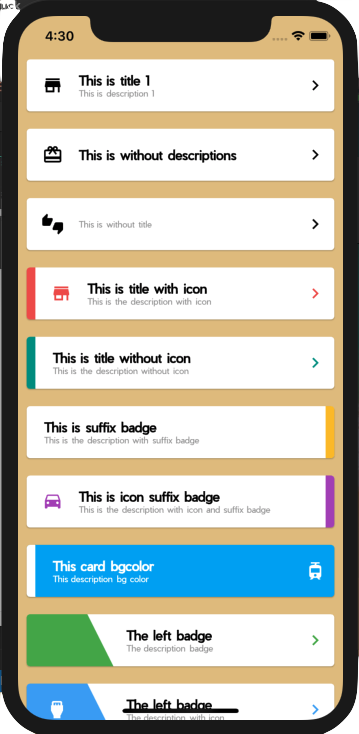
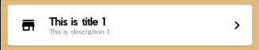

# Flutter Cards UI Kit

A collection of cards that you can use easily and ready to be used in your applications.

## Screenshots And Usage



this card divided by 4 Cards, `EasyCard` , `EasyBadgeCard`, `CircleBadgeCard`, and `EaasyMultipleCard`. 
Don't forget to import these images `triangle_left.png`, `triangle_right.png`, `triangle_inv_left.png`, 
`triangle_inv_right.png`, and `circle.png` if you want to use badge and circle card.
And yes of course don't forget to update your `pubspec.yaml`

### Easy Card
_Example #1_


```
new EasyCard(
  icon: Icons.store,
  title: 'This is title 1',
  description: 'This is description 1',
  suffixIcon: Icons.chevron_right,
),
```
This is the basic one, if you don't set any color, everything will be _black_, 
EXCEPT the description it will become _grey_.

_Example #2_
(./ss/ss2.png)

```
new EasyCard(
  icon: Icons.card_giftcard,
  title: 'This is without descriptions',
  suffixIcon: Icons.chevron_right,
),
```
You can also remove the description if you don't need them.

_Example #3_
(./ss/ss3.png)

```
new EasyCard(
  icon: Icons.thumbs_up_down,
  description: 'This is without title',
  suffixIcon: Icons.chevron_right,
),
```
Or maybe you don't need the title, why not ?

_Example #4_
(./ss/ss4.png)

```
new EasyCard(
  prefixBadge: Colors.red[400],
  icon: Icons.store,
  iconColor: Colors.red[400],
  title: 'This is title with icon',
  description: 'This is the description with icon',
  suffixIcon: Icons.chevron_right,
  suffixIconColor: Colors.red[400],
),
```
You can make a badge in the left of the card and also coloring it using `prefixBadge`, 
and you coloring the icon with `iconColor`.

_Example #5_
(./ss/ss5.png)

```
new EasyCard(
  prefixBadge: Colors.teal[500],
  title: 'This is title without icon',
  description: 'This is the description without icon',
  suffixIcon: Icons.chevron_right,
  suffixIconColor: Colors.teal[500],
),
```
Wanna remove the icon ? of course it's easier.

_Example #6_
(./ss/ss6.png)

```
new EasyCard(
  title: 'This is suffix badge',
  description: 'This is the description with suffix badge',
  suffixBadge: Colors.yellow[700],
),
```
"What if I want the badge is in the right of the card ?" relax, I already made it for you using `suffixBadge`.

_Example #7_
(./ss/ss7.png)

```
new EasyCard(
  icon: Icons.time_to_leave,
  iconColor: Colors.purple[400],
  title: 'This is icon suffix badge',
  description:
  'This is the description with icon and suffix badge',
  suffixBadge: Colors.purple[400],
),
```
"The icon ?" still there

_Example #8_
(./ss/ss8.png)

```
new EasyCard(
  prefixBadge: Colors.white,
  backgroundColor: Colors.lightBlue,
  title: 'This card bgcolor',
  description: 'This description bg color',
  titleColor: Colors.white,
  descriptionColor: Colors.white,
  suffixIcon: Icons.tram,
  suffixIconColor: Colors.white,
),
```
Not only the white card, you can make colored card of course by using `backgroundColor`

### Easy Badge Card
Now we will use more decoration to our cards using `EasyBadgeCard`

_Example #1_
(./ss/ss9.png)

```
new EasyBadgeCard(
  leftBadge: Colors.green[500],
  title: 'The left badge',
  description: 'The description badge',
  suffixIcon: Icons.chevron_right,
  suffixIconColor: Colors.green[500],
),
```
looks, so awesome and easy right. Only call `leftBadge` and you will have that decoration badge.

_Example #2_
(./ss/ss10.png)
```
new EasyBadgeCard(
  leftBadge: Colors.blue[400],
  title: 'The left badge',
  description: 'The description with icon',
  prefixIcon: Icons.settings_input_hdmi,
  prefixIconColor: Colors.white,
  suffixIcon: Icons.chevron_right,
  suffixIconColor: Colors.blue[400],
),
```
You want use badge with the Icon ? easy, add `prefixIcon` and `prefixIconColor` and wolololoo....

_Example #3_
(./ss/ss11.png)
```
new EasyBadgeCard(
  leftBadge: Colors.white,
  title: 'The white badge',
  description: 'The description with white badge and bg color',
  backgroundColor: Colors.orange[500],
  prefixIcon: Icons.settings_input_hdmi,
  prefixIconColor: Colors.orange[500],
  suffixIcon: Icons.chevron_right,
  suffixIconColor: Colors.white,
  titleColor: Colors.white,
  descriptionColor: Colors.white,
),
```
And if you want to do inverse, the card have color and white badge, use `backgroundColor`.
it's little bit longer but still easier than make from scratch.

_Example #4_
(./ss/ss12.png)
```
new EasyBadgeCard(
  title: 'This title',
  description: 'This description',
  rightBadge: Colors.amber,
  suffixIcon: Icons.transfer_within_a_station,
  suffixIconColor: Colors.white,
),
```
"I bet you can't make a card with badge in the right!", oops. try again sweetheart.
use `rightBadge` instead of `leftBadge`.

_Example #5_
(./ss/ss13.png)
```
new EasyBadgeCard(
  title: 'This title',
  description: 'This description',
  backgroundColor: Colors.yellowAccent,
  rightBadge: Colors.white,
  suffixIcon: Icons.translate,
),
```
and the `rightBadge` could do inverse too.

### Circle Badge Card
Now we will use another decoration to our cards using `CircleBadgeCard`

_Example #1_
(./ss/ss14.png)
```
new CircleBadgeCard(
  title: 'Circle Title',
  description: 'mini description',
  backgroundColor: Colors.red,
),
```
only using this 3 attributes, and your circle badge card is already created.

_Example #2_
(./ss/ss16.png)
```
new CircleBadgeCard(
  title: 'Circle Title',
  description: 'mini description',
  backgroundColor: Colors.blueAccent,
  icon: Icons.crop_original,
  iconColor: Colors.blueAccent,
),
```
yes, you can add your icon to this card like usual, and coloring all of them using `iconColor` , `titleColor`, 
nor `descriptionColor`.


### Easy Multiple Card
Now we can make multiple card using `EasyMultipleCard`, I hope in the future I could make another one with multiple things, 
Because I need to go home now. I will continue tomorrow, wwww.

_Example #1_
(./ss/ss15.png)
```
new EasyMultipleCard(
  title: 'Payment method',
  suffixIcon: Icons.chevron_right,
  dividerColor: Colors.blue[100],
  items: <Widget>[
      new ItemMultipleCard(
          icon: Icons.account_balance_wallet,
          title: 'Wallet',
          status: 'available',
      ),
      new ItemMultipleCard(
        icon: Icons.card_giftcard,
        title: 'Point',
        status: 'not available',
        statusColor: Colors.red,
      ),
      new ItemMultipleCard(
        icon: Icons.credit_card,
        title: 'Credit card',
        status: 'available',
      ),
    ],
),
```
`EasyMultipleCard` has `title`, `prefixIcon` and `suffixIcon`. and the divider you can coloring it as you want using 
`dividerColor`. `EasyMultipleCard` has children with each item using `ItemMultipleCard`, it has `icon` , `title` ans `status`.
And yes of course you can coloring them all.

Thanks guys, feel free to contribute to this simple ez pz lemon squeezy project. I don't want you to donate me just wish me
that I could get her heart, and live together forever with someone who has boyfriend already :')
